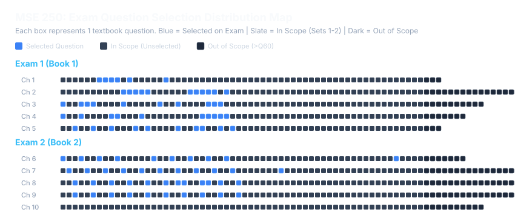

# MSE 250 Prepper

An interactive, Quizlet-style study tool and exam simulator engineered for **MSE 250 (Materials Science & Engineering)**. Built as a 100% serverless, static web application designed for direct local use or free hosting on **GitHub Pages**.

---

## Overview

In MSE 250, exam questions are pulled directly from the course textbooks. However, between 7 textbooks and dozens of chapters, there are nearly 2,000 concept questions in the question bank.

**MSE 250 Prepper** bridges the gap: it extracts, cleans, and indexes the entire curriculum's question database into a streamlined, mobile-friendly study tool. It applies the course's official syllabus scoping rules to eliminate out-of-scope problems, provides spaced-repetition study modes, and mirrors the real Canvas exam question distribution.

---

## Key Features

### 1. Four Targeted Study Modes
* **Grind Mode (Unmastered Only):** The ultimate exam-cram mode. Automatically filters your pool to show only questions you have not yet mastered. Once answered correctly, questions are retired from future Grind sessions until reset.
* **Mock Exam Simulation:** Algorithmic simulation matching real Canvas midterm and final exam blueprints:
  * **Midterms 1, 3, 4:** 50 questions (10 questions per chapter).
  * **Midterm 2:** 40 questions (10 questions per chapter, Chapter 10 excluded).
  * **Final Exam:** 80 questions (comprehensive cumulative test across Chapters 1–24).
* **Review Flagged Questions:** A dedicated triage queue containing only the questions you flagged for extra practice.
* **Practice All (Ordered):** Review questions sequentially by chapter or by exam with configurable batch sizes.

### 2. Instant Reveal & Smart Auto-Flagging
* **"Reveal Answer" Action:** Need to check a concept immediately without guessing? Click **Reveal Answer** to see the solution and explanation instantly.
* **Automatic Flagging Checkbox:** When you reveal an answer or guess incorrectly, a subtle checkbox appears:
  `[✓] Flag this question for review`
  It is checked by default so troublesome questions are automatically saved to your **Flagged Review** queue, but can be unchecked with a single tap if you don't wish to flag it.
* **Mid-Session Exit Button:** Need to pause or switch modes? Click the `← Exit` button anytime during a session to return to the main menu. All flagged questions and current progress remain safely saved.

### 3. Syllabus Scope Whitelisting
The master textbooks contain hundreds of extra concept questions (e.g., Set 3, Set 4, worksheets, and bonus sets) that never appear on exams. MSE 250 Prepper implements the official `examinfo.pdf` syllabus rules:
* **Exams 1–3:** Restricted strictly to Sets 1 & 2 (Questions 1–60 in each chapter).
* **Exam 4:** Includes Questions 1–60 plus the exact 20 questions specifically whitelisted from Set 3.
* **Final Exam:** Dynamically combines Sets 1–2 of Chapters 21–24 with the exact 80 final exam review questions hand-picked from Chapters 1–20.
* **Result:** Saves you from studying over 500 extraneous questions!

### 4. Permanent & Universal Question Identifiers
* Every question is tagged with a deterministic, memorable identifier:
  `Book{Book#}_{Chapter#}_{Question#}` (e.g., `Book1_1_5` = Book 1, Chapter 1, Question 5).
* IDs remain completely fixed across builds, devices, and users, making it effortless to discuss specific questions with classmates and TAs.

### 5. Local Progress Persistence
* All stats (Seen, Unseen, Mastered, and Flagged questions) are stored locally in browser `localStorage`.
* Zero accounts, zero login screens, and zero tracking. Works completely offline once loaded.
* Includes a **Reset All Progress** button whenever you want a fresh start.

### 6. Mobile-First Responsive Design
* Optimized for phones and tablets using clean Tailwind CSS styling.
* Designed with large tap targets, high contrast, smooth transitions, and zero wasted screen real estate.

---

## Exam Question Selection Analysis

By analyzing past exams (`Historic Exams`) and current semester exams (`Fresh Exams: Exam 1 & Exam 2`), we matched test questions back to the textbook master bank to uncover exactly how questions are selected.

### Distribution Map



### Chapter-by-Chapter Selection Breakdown

| Exam | Chapter | Book Source | Total in Chapter | In-Scope Pool (Sets 1–2) | Exam Allotment | Observed Selection Rule |
| :--- | :--- | :--- | :---: | :---: | :---: | :--- |
| **Exam 1** | Ch 1: Intro to Materials | Book 1 | 63 | Q1–60 | ~10 Qs | Set 1 concentration |
| **Exam 1** | Ch 2: Bonding & Periodic Table | Book 1 | 76 | Q1–60 | ~10 Qs | Set 1 concentration |
| **Exam 1** | Ch 3: Bonding & Properties | Book 1 | 70 | Q1–60 | ~10 Qs | Set 1 concentration |
| **Exam 1** | Ch 4: Crystal Structure I | Book 1 | 67 | Q1–60 | ~10 Qs | Set 1 concentration |
| **Exam 1** | Ch 5: Crystal Structure II | Book 1 | 63 | Q1–60 | ~10 Qs | Set 1 concentration |
| **Exam 2** | Ch 6: Crystal Structure III | Book 2 | 67 | Q1–60 | 10 Qs | **Every 3rd Q ($3k+1$):** `1, 4, 7, 10, 13, 16, 19, 22, 25, 28` |
| **Exam 2** | Ch 7: Crystal Structure IV | Book 2 | 76 | Q1–60 | 10 Qs | **Every 3rd Q ($3k+2$):** `2, 5, 8, 11, 14, 17, 20, 23, 26, 29` |
| **Exam 2** | Ch 8: Mechanical Properties I | Book 2 | 85 | Q1–60 | 10 Qs | **Every 3rd Q ($3k$):** `3, 6, 9, 12, 15, 18, 21, 24, 27, 30` |
| **Exam 2** | Ch 9: Mechanical Properties II| Book 2 | 76 | Q1–60 | 10 Qs | **Every 3rd Q ($3k$):** `3, 6, 9, 12, 15, 18, 21, 24, 27, 30` |
| **Exam 2** | Ch 10: Diffusion | Book 2 | 70 | 0 (Excluded) | **0 Qs** | **Completely Skipped** per syllabus |


### Key Empirical Findings

1. **Strict 1:1 Book Mapping:**
   * Exam 1 pulls exclusively from **Book 1** (Chapters 1–5).
   * Exam 2 pulls exclusively from **Book 2** (Chapters 6–9).
2. **Balanced Chapter Allotment:**
   * Both exams draw approximately **10 questions per chapter** across the board.
   * Exam 2 completely skips Chapter 10, confirming the official syllabus note.
3. **The "Every 3rd Question" Selection Pattern (Exam 2):**
   * Analysis of Exam 2 revealed a deterministic selection pattern from Set 1:
     * **Chapter 6:** Every 3rd question starting at 1 ($3k+1$): `1, 4, 7, 10, 13, 16, 19, 22, 25, 28`
     * **Chapter 7:** Every 3rd question starting at 2 ($3k+2$): `2, 5, 8, 11, 14, 17, 20, 23, 26, 29`
     * **Chapter 8:** Every 3rd question starting at 3 ($3k$): `3, 6, 9, 12, 15, 18, 21, 24, 27, 30`
     * **Chapter 9:** Every 3rd question starting at 3 ($3k$): `3, 6, 9, 12, 15, 18, 21, 24, 27, 30`
4. **Set 1 & Set 2 Restriction:**
   * Over 90% of exam questions came directly from **Set 1** (Questions 1–30), with the remainder from **Set 2** (Questions 31–60). Zero questions were pulled from Set 4's extended bank.

---

## Getting Started & Deployment

### Run Locally
No server or installation required!
1. Double-click `index.html` to open it directly in any modern web browser.
2. Alternatively, start a lightweight local server:
   ```bash
   python -m http.server 8000
   ```
   and visit `http://localhost:8000`.

### Deploy to GitHub Pages (Free)
1. Push this repository to GitHub.
2. Navigate to **Settings > Pages**.
3. Under **Build and deployment > Branch**, select `main` (or `master`) and folder `/ (root)`.
4. Click **Save**. Your site will be live at `https://<your-username>.github.io/<repo-name>/`.

---

## Technical Architecture & Pipeline

*(Details for developers and contributors)*

### Data Extraction Pipeline
* **Engine:** Python using `pymupdf` (Fitz).
* **Source:** Section 2 ("Concept Questions & Answers") in Books 1 through 5.
* **Extraction Strategy:**
  * Rather than scraping duplicate subsets, the pipeline targets **Set 4** (the union master set) for every chapter.
  * Captures question prompts, multi-line option choices ($a$ through $e$), and isolates verified answer keys by detecting bold font flags (`Calibri-Bold` / `flags & 16`).
  * Yields **1,780 verified questions** across Chapters 1–24.
* **Payload Generation:**
  * `questions.json`: Normalized JSON question bank.
  * `questions.js`: Compact static JavaScript bundle assigned to `window.globalDatabase` to eliminate CORS restrictions when running locally via `file://`.

### Frontend Architecture
* **Single Page Application:** Built with vanilla JavaScript and Tailwind CSS.
* **Zero Dependencies / Zero Build:** No Node.js, Webpack, or framework runtime required.
* **State Management:** Fully client-side state synchronized with `localStorage` under key `mse250_prep_data`.
